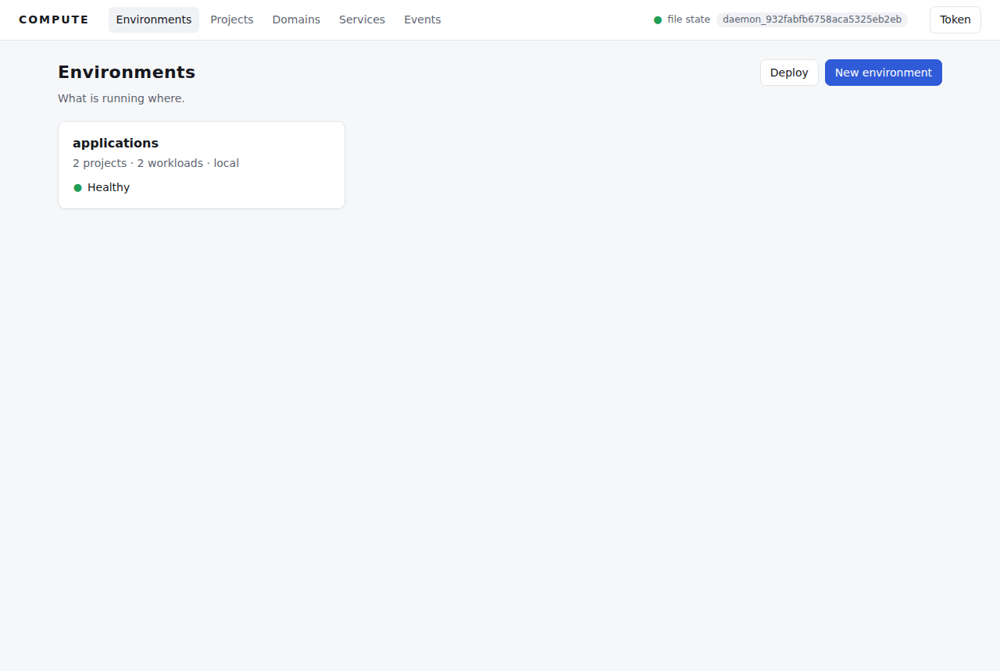
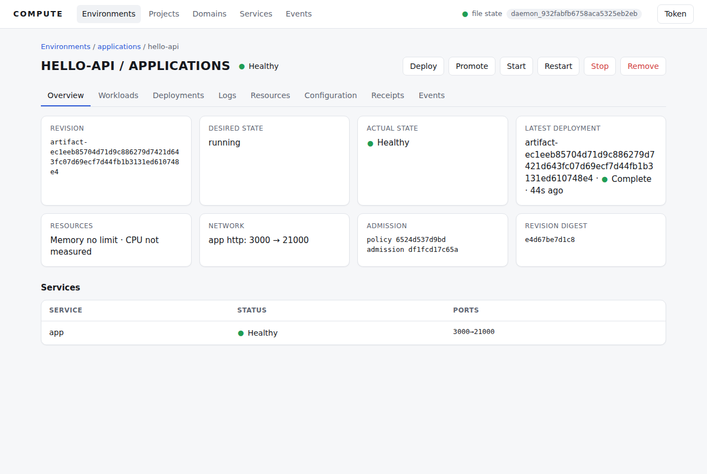
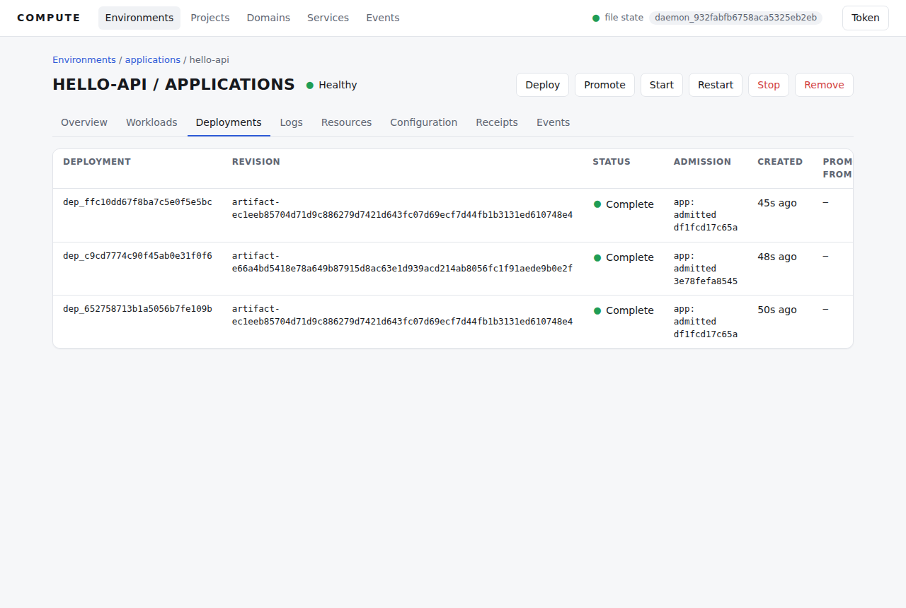
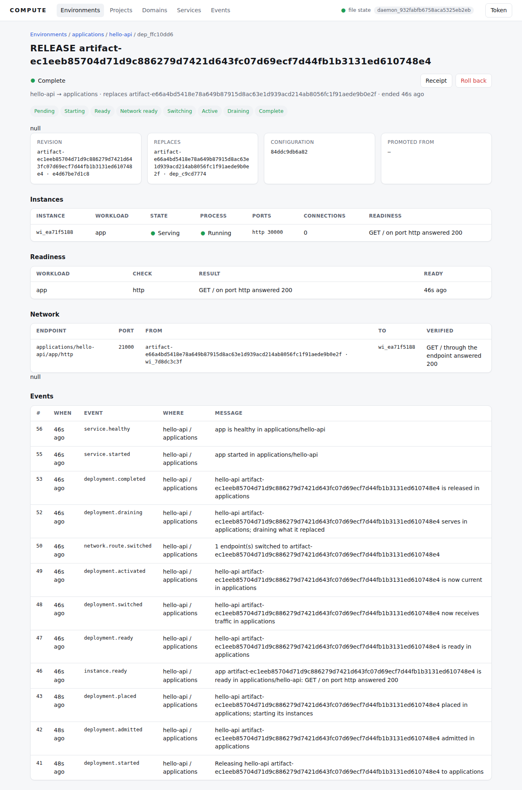
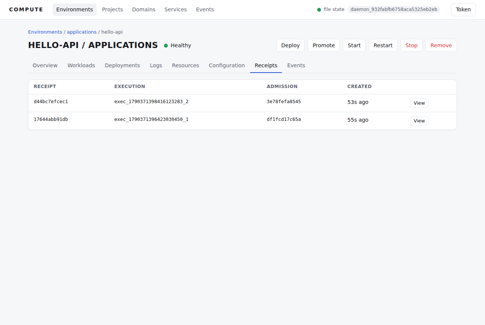

# Compute Audit

Audited 2026-09-25 at `7a3a160` (branch `claude/compassionate-pascal-52kc2l`).
It answers one question: **does this code make portable execution meaningfully
easier for a developer or an autonomous agent?** Every claim below cites
source, a test, or a journey that was run during the audit. What could not be
run is labelled that way. Nothing here is taken from a design document without
checking it against the code.

Evidence lives in [`audit-evidence/`](audit-evidence/):
[`journey.md`](audit-evidence/journey.md) (commands and output) and
[`ui/`](audit-evidence/ui/) (screenshots of the control-plane UI with real
deployed applications).

**Environment.** Linux x86_64 container, debug build. The network policy denies
`dl-cdn.alpinelinux.org`. Apple Container (the macOS `container` CLI) was
**not available**, so nothing here claims to have reproduced the Apple
Container acceptance script. Where a result depends on the Apple Container
environment, it is labelled *not reproduced*.

---

## Executive Summary

Compute today is **two products that share an execution engine but do not
meet**:

| | `compute run APP` (pool/job path) | `compute deploy APP` (daemon/release path) |
|---|---|---|
| Crosses providers | **Yes.** Placement matches requirements against local and remote providers. | **No.** Services must run on the daemon's own node (`daemon/execute.rs`: "services run on the daemon's own node"). |
| Stable endpoint | No. It echoes the provider's configured `application_endpoint` string. | Yes, node-local: a host port held by the supervisor across releases. |
| Versions, history, rollback | Job list only | Yes: `v1…vN`, immutable revisions, rollback-as-new-version |
| Durable authority | Provider's filesystem job store | `compute-state` (file or FeltDB) |
| Works out of the box | **No.** The default pool is `local` only, and `local` cannot take jobs (`jobs_unsupported`). | Yes, once the runtime is prepared (**fixed in this PR**; before, it failed on any machine without the exact catalog runtime installed). |

The **portability thesis** (requirements → capability matching → any
compatible provider) is real, but only on the path without a product
lifecycle. The **product lifecycle** (deploy, endpoint, history, rollback,
receipt) is real, but only on one node. The minimum compelling product is
joining these two (see [Minimum Compelling Vertical Slice](#minimum-compelling-vertical-slice)).

Engineering effort is concentrated in the single-node control plane
(environments, releases, supervisor, FeltDB): ~37% of Rust source is daemon
plus persistence. The application layer is 1.8% (one CLI file with no daemon
API). The UI has no application concept at all
([screenshots](#observability)). No automated test exercises
`compute deploy/status/logs/history/rollback/stop` on an application. The
only product acceptance is an Apple Container shell script that is not in CI,
and CI does not run `cargo test --workspace`.

**Apple Container is not coupled into the code.** No Rust source names it. It
appears only in `.container/` fixtures and the acceptance script, where it
hosts `compute serve` (a *remote provider*) and `compute start` (a daemon).
During this audit the same remote-provider lifecycle ran unchanged against
`compute serve` on a plain Linux host (journey 6). The practical coupling is
elsewhere: every catalog runtime ships Linux artifacts only, so a Mac
developer needs a Linux environment to get a catalog runtime.

**Defect fixed in this PR** (the minimum needed for the audit's developer
journey to be measurable): the daemon's service path admitted and started
services without preparing a catalog runtime advertised as `available`, so
`compute init && compute deploy` failed with `runtime_unavailable: node`
unless Node 24.18.0 had already been installed by some other command.
`dispatch::prepare_runtime` now exposes the preparation step tasks and jobs
already use, and the service branch calls it
(`crates/compute-placement/src/dispatch.rs`, `crates/compute-environment/src/daemon/execute.rs`).
Verified with an empty runtime store: `compute init demo && compute deploy demo`
served in 6.4 s (journey 3). Other defects found are listed, not fixed.

---

## Compute North Star

> Compute is the portable execution fabric for software. An application says
> what it needs; Compute decides where and how it runs, whether the
> environment can satisfy it, how it is isolated and operated, and what
> happened. **Build software once. Run it wherever Compute can satisfy its
> requirements.**

The audit measures the code against that definition, with one
provider-neutrality rule: *any environment that can satisfy the Compute
execution contract can be a provider*. Apple Container is one such
environment and an acceptance target. It is not the product.

## What Compute Actually Is Today

From the code, not the README:

1. **A deterministic workload execution engine** (`compute-core`,
   `compute-runtime*`). A `WorkloadSpec` or `.compute` bundle is run by one of
   two adapters: `ProcessRuntime` (Python, Node, Bun, Deno, Ruby, PHP, JVM,
   .NET, native, shell as host processes) or `WasmRuntime` (wasmtime). Output
   is a result plus a hash-sealed `compute.receipt@1`.
2. **A pinned runtime catalog** (`distribution/runtime-lock.json`,
   `compute-provider/src/runtime.rs`). Exact versions with SHA-256 digests,
   downloaded, verified and prepared on demand. Linux-only artifacts.
3. **A provider protocol and a placement engine** (`compute-provider`,
   `compute-placement`). Two providers exist: `LocalProvider` (in process) and
   `RemoteProvider` (HTTP client for `compute.remote@1`). The server side
   (`compute serve`) is a `LocalProvider` behind HTTP with a durable
   filesystem job store and capacity reservations. **A remote provider is
   another Compute installation, not an infrastructure adapter.** No code
   provisions a container, VM or cloud instance.
4. **A single-node control plane** (`compute-environment`, `compute-state*`,
   `compute-network`). A daemon with environments, projects and revisions,
   zero-downtime releases, a supervisor that outlives the controller,
   node-local endpoints, domains, DNS (Cloudflare, Hetzner, file), ACME,
   operator credentials, upgrades, and durable state in a file or FeltDB.
5. **A thin application veneer** (`compute-cli/src/application.rs`, 1,064
   lines). `compute init/run/deploy/status/logs/history/rollback/stop APP`
   map to (3) or (4). The daemon has no Application entity: an application is
   a project named after `[application].name` inside a fixed environment
   called `applications`, with one workload called `app`
   (`APPLICATION_ENVIRONMENT`, `APPLICATION_WORKLOAD`).

## Provider Neutrality

**Abstractions that keep Compute provider-neutral** (real, exercised):

- `ComputeProvider` (`compute-provider/src/lib.rs:540`): identity,
  capabilities, health, resolve/prepare runtime, admit, execute.
- `compute.remote@1` HTTP protocol (`parse_route`, `lib.rs:1920`), plus
  durable jobs (`jobs.rs`).
- `PlacementRequirements` → `ProviderDescriptor` matching (`compute-placement`),
  with runtime/version/platform/resources/network/isolation/dependencies.
- Runtime distribution identity bound into receipts (a workload says `node >=24`;
  the provider proves which exact distribution ran).
- `application_endpoint` in the pool config: explicit because it "cannot be
  inferred safely through proxies, NAT, or container port mappings"
  (`compute-placement/src/pool.rs`). This is generic, not Apple-specific.

**Accidental Apple Container coupling found in code: none.**
`grep -ri apple` over the Rust sources matches only a CSS font name.

**Coupling found outside code:**

| Where | What | Severity |
|---|---|---|
| `.container/acceptance/placement-scheduling.sh` | The only end-to-end product acceptance calls the `container` CLI directly (`container build/run/stop`) | High: the product has no provider-neutral acceptance |
| `.container/runtime-catalog/README.md` | Calls provider id `remote` "an explicit Apple Container provider" | Low (wording) |
| `distribution/runtime-lock.json` | Every runtime artifact is `linux-*`; no macOS artifacts | Medium: on macOS, catalog runtimes are unresolvable, so a Mac developer's working provider is a Linux VM/container |
| Directory name `.container/` | Acceptance fixtures are organised by provider, not by product scenario | Low |

## Product Surface

`compute --help` lists **47 top-level commands** (`main.rs:42-129`), plus
subcommands. Classification:

| Class | Commands |
|---|---|
| **Application/product** | `init`, `run` (when the path has `[application]`), `deploy` (same), `status APP`, `logs APP`, `history APP`, `rollback APP`, `stop APP`, `deployment {list,inspect,status,rollback,receipt}` |
| **Workload execution** (portable engine) | `run FILE`, `exec`, `inspect`, `bundle`, `deps`, `receipt {inspect,verify}`, `explain` |
| **Infrastructure/operator** | `provider`, `capacity`, `jobs`, `placement`, `pool`, `remote`, `runtimes`, `runtime`, `capabilities`, `isolation`, `policy`, `serve`, `start`, `stop` (no arg), `status` (no arg), `environment`, `project`, `workload`, `execution`, `promote`, `domain`, `dns`, `certificate`, `network`, `events`, `service`, `control-plane`, `auth`, `node`, `supervisor` |
| **Build/release engineering** | `distribution`, `certify`, `doctor`, `version` |

Overloaded verbs leak infrastructure into the product surface. `compute stop`
stops the daemon, while `compute stop APP` stops an application. The same
split applies to `compute status`. `compute deploy X` is an application deploy
when `X/compute.toml` has `[application]`, and otherwise a project release that
requires `--environment` (`main.rs:1474-1480`).

### Product Surface Matrix

| Surface | Command / API | What the user thinks it does | What the code actually does | Durable? | Provider-neutral? | Real acceptance? | Maturity |
|---|---|---|---|---|---|---|---|
| init | `compute init DIR [--runtime node\|python]` | Create an app | Writes `compute.toml` (`[application] name, port=3000`, runtime, resources, `placement.policy="auto"`) and a hello-world HTTP server (`application.rs:171`) | File only | Yes | `cli.rs` (2 tests) | Solid |
| run | `compute run APP` | Run my app | Placement with `SubmissionMode::Job`, then a durable job on a **remote** provider. With the default pool it **fails** (`jobs_unsupported`, journey 1) | Provider job store | Yes, across remote providers | Apple script (not reproduced); journey 6 on Linux | Works only with a hand-written pool TOML |
| deploy | `compute deploy APP` | Ship a new version | Auto-starts a local daemon (`--insecure`, state in `./.compute/daemon` **relative to CWD**), registers revision `artifact-<bundle_id>`, and creates a deployment in env `applications` (`application.rs:298`) | `compute-state` | **No**: services are local-node only | Apple script (not reproduced); journeys 2-3 | Works after fix; local only |
| status | `compute status APP` | Is it up, where? | Active deployment if the daemon knows the app; otherwise the newest job across **every** pool provider, by listing all jobs and filtering client-side (`application_jobs`) | Derived | Partially | Journeys 3, 6 | OK |
| logs | `compute logs APP` | Recent output | Daemon: whole workload log buffer. Job path: provider job logs | Daemon logs are node-local files; not in state | — | Journeys 3, 6 | Basic |
| logs --follow | `compute logs APP --follow` | Tail | Polls the full log every 250 ms and prints the delta (`print_delta`) | — | — | Not tested | Basic |
| stop | `compute stop APP` | Stop my app | Daemon: `POST …/projects/APP/stop`, waits for `stopped`. Job path: cancel the job | Yes | — | Journeys 3, 6 | OK |
| history | `compute history APP` | Past versions | Daemon: deployments newest first, but **superseded deployments print `running`** (`deployment_status` maps `Complete`→`running`). Job path: job list | Yes | — | Journey 3 | Misleading |
| deployment | `compute deployment {list,inspect,status,receipt,rollback} dep_…` | Inspect a version | Raw daemon views; `receipt` is always JSON | Yes | — | Journey 3 | Operator-grade |
| rollback | `compute rollback APP VERSION\|dep_…` | Go back | Redeploys the target revision **and its config** as a new version (`application.rs:619`) | Yes | — | Journey 3 | Good |
| JSON output | `--json` | Machine-readable | Per-command shapes. `run --json` for a placed workload that fails prints the placement report. The application `status --json` shape differs between the daemon path and the job path | — | — | Partial | Inconsistent |
| Errors | — | Actionable | Placement failures are printed as `runtime error: no provider proved it satisfies this workload contract…`. Detail (`jobs_unsupported`) only in `--json` | — | — | — | Leaky |
| Help | `--help` | — | Application verbs have product wording. `--provider` help advertises `auto`/`provider:<id>`, **which do not work** (journey 5) | — | — | `cli.rs` help test | Mismatch |
| Configuration | `compute.toml`, `compute-pool.toml`, `COMPUTE_*` env | One file | App config in `compute.toml`; providers in `compute-pool.toml` (default `./compute-pool.toml`); daemon via `--daemon`/`COMPUTE_DAEMON` | — | Yes | — | Two files, two worlds |
| Defaults | — | Sensible | Pool = `local` only; daemon = `127.0.0.1:8787`, port range 20000-29999, endpoint address `127.0.0.1`, `--insecure` when auto-started | — | — | — | Dev-only |
| Provider selection | `--provider ID`, `--policy auto\|local\|remote`, `--prefer-provider` | Choose where | `run` path only. The deploy path takes the environment's `provider` field, but a non-local selection fails for services | — | Run path only | Apple script | Partial |
| Runtime selection | `[runtime] name, version, architecture` | Choose runtime | Resolved to an exact catalog distribution, then acquired, verified and prepared | — | Yes | Journeys 3, 6 | Good |
| Endpoint | printed by `deploy`/`status` | Stable URL | Deploy: `http://<daemon host>:<host port>` built by string surgery on the daemon URL (`application_endpoint()`). Run: the provider's static configured string | Deploy: yes (traffic records) | — | Journeys 3, 6 | Node-local |

**Missing entirely:** `compute list` (applications), `compute deployments APP`
(exists only as `compute deployment list` with env/project filters),
`compute receipt <id>` fetching by ID (the `receipt` command reads files),
application delete, and `compute open`/URL helpers.

## Developer Journey

Run end to end on this machine ([journey.md](audit-evidence/journey.md)). The
example app is `examples/compute-demo` (Node HTTP server, no README).

| Step | Command | Source | Persistence | Tests | Result here | Friction |
|---|---|---|---|---|---|---|
| Create | `compute init my-app` | `application.rs:171` | files | `cli.rs` | ✅ | none |
| Configure | edit `compute.toml` | `direct.rs`, `application::definition` | file | — | ✅ | `[resources]` are placement requirements, **not limits**; the UI shows "Memory no limit" for a 512 MiB app |
| Run | `compute run my-app` | `application::run` | — | — | ❌ `jobs_unsupported` with the default pool | Needs a remote provider and a pool TOML; the error does not say so |
| Deploy | `compute deploy my-app` | `application::deploy` | state | none in cargo | ❌ before the fix (`runtime_unavailable: node`), ✅ after (6.4 s cold) | A daemon silently spawned with `--insecure`, state dir under CWD |
| Receive endpoint | printed | `print_application_deployment` | traffic record | — | ✅ `http://127.0.0.1:20000` | loopback only |
| HTTP request | `curl` | supervisor forwarder | — | — | ✅ | — |
| Status | `compute status my-app` | `application::status` | derived | — | ✅ | — |
| Logs | `compute logs my-app` | daemon logs route | node-local files | — | ✅ | shows `listening on 30000` (instance port), not the endpoint port |
| Update | edit + `compute deploy` | release state machine | state | `releases.rs` (env model) | ✅ `v3` served new code | — |
| History | `compute history my-app` | `application::history` | state | — | ⚠️ superseded versions shown as `running` | misleading |
| Rollback | `compute rollback my-app 2` | `application::rollback` | state | `releases.rs` (env model) | ✅ `v4`, old code served | — |
| Stop | `compute stop my-app` | project stop | state | env tests | ✅ | endpoint then resets connections |
| Inspect receipt | `compute deployment receipt dep_…` | `release.rs:1663` | artifact store | — | ⚠️ `execution_receipts: []` for services | the execution receipt must be found through a raw API route |

Concepts a user must understand to get through the journey: *provider* (to
make `run` work), *pool* (TOML), *daemon* (auto-started, CWD-relative),
*deployment ID*, *revision* (`artifact-<64 hex>`), *environment* (the UI shows
`applications`), and *job* (the run path prints `Job`, `Admission`,
`Placement`). Capacity and reservation stay hidden unless `run` hits capacity.

## Agent Journey

**Can an agent (Eve) operate a Compute application without shelling out to
the CLI?** **Partially. The missing boundary is application-level and
revision-registration APIs.**

| Operation | Programmatic path today | Gap |
|---|---|---|
| application.create | none (files only) | local file writes, fine for an agent |
| application.run | `compute.remote@1` `POST /compute/jobs` with a bundle and `execution.application` | the agent must build a deterministic `.compute` bundle itself (Rust `WorkloadBundle`; CLI `compute bundle create`) |
| application.deploy | Daemon `POST /projects/{p}/revisions` then `POST /deployments` | knowledge of the CLI-private convention (env `applications`, workload `app`, port spec, readiness) plus bundle bytes. AppPort has **no** revision capability |
| application.status | `GET /environments/applications/projects/{p}` + `GET /deployments/{id}` | two calls, convention-dependent |
| application.logs | `GET …/workloads/app/logs` | not in AppPort |
| application.stop | `POST …/projects/{p}/stop` | AppPort has `compute.environment.*`, and a project stop via its env client |
| application.history | `GET /deployments?environment=applications&project=p` | — |
| application.rollback | `POST /deployments` with the old revision and config (what the CLI does) or `POST /deployments/{id}/rollback` (release semantics differ) | two rollback semantics |
| execution.get | `GET /executions/{id}` | — |
| receipt.get | `GET /receipts/{id}` | **returned bytes are not canonical, so `compute receipt verify` rejects them** (journey 4) |

**AppPort (`packages/compute-appport`)** exposes 38 capabilities. The
execution ones (`compute.run`, `compute.inspect`, `compute.pool.*`,
`compute.submit`…) **spawn the `compute` binary** (`provider.ts:580`). The
environment ones call the daemon HTTP API. None is application-level, and
none registers a revision or reads logs, so an agent cannot deploy through
AppPort alone.

**Smallest missing agent boundary:** a daemon `applications` resource
(`/applications/{name}` with deploy-from-bundle, status, logs, history,
rollback, stop, receipts) that owns the convention `application.rs`
currently hard-codes client-side, plus matching AppPort capabilities.

## Application Model

**Is Application a durable domain object, or a convenience abstraction?** It
is a **convenience abstraction** over two different substrates.

- **Identity:** `ApplicationIdentity { id = sha256("compute.application@1", name), name, port }`
  (`compute-core/src/jobs.rs:20`). Name only. Two unrelated directories with
  the same name are the same application; there is no owner or namespace.
- **Persistence:** none of its own. On the run path it is sealed into job
  requests and found by listing every job on every provider
  (`application_jobs`). On the deploy path it is a project record in env
  `applications`. The module header states it plainly: "there is no second
  application database".
- **Configuration:** `compute.toml` on the developer's disk. The daemon stores
  the bundle, not the application definition.
- **Lifecycle, status, history:** derived from jobs or deployments. Which one
  depends on whether the daemon answers (`status`, `logs`, `history` try the
  daemon first, then the pool).
- **Endpoint:** a deployment property, not an application property (see
  [Networking](#networking--endpoints)).
- **Deletion:** no application delete. `DELETE /environments/applications/projects/{p}` exists.
- **Provider independence:** yes on run; no on deploy (single node).
- **Receipts:** execution receipts carry `application` on the job path only.
  Daemon execution receipts carry `scope` (environment, project, workload), not
  `application`. The deployment receipt carries `application` with `port`
  omitted.

## Deployment Model

Traced through `application::deploy` → `POST /projects/{p}/revisions` →
`POST /deployments` → `daemon/deploy.rs` / `daemon/release.rs`.

| Question | Answer (code) |
|---|---|
| Durable? | Yes: `DeploymentRecord` in `compute-state` (`model.rs:382`) |
| Identity | `dep_…` |
| Version | `version: u64`, monotonic per project (legacy records read 0) |
| Immutable? | The revision is: `ProjectRevisionRecord` holds the bundle artifact digest. The deployment record mutates through its state machine |
| Configuration captured | `config` map + `config_digest`; environment config layered at run time (`execute.rs::prepare`) |
| Artifact | Bundle stored content-addressed (`ArtifactStore`); revision name `artifact-<bundle_id>` |
| Runtime resolved | At placement for each instance start, not frozen in the deployment. `DeploymentWorkload.distribution` is recorded evidence |
| Provider | `local` for services, always |
| Job/execution created | One `ExecutionRecord` per service start (`exec_…`), with a receipt when it ends |
| Endpoint | `DeploymentWorkload.endpoints` (logical 3000 → host 20000). Held stable across deployments via `TrafficAssignmentRecord` |
| Receipt | `compute.deployment-receipt@1` JSON artifact, written when the release ends; **not signed; lists no service execution receipts** |
| Multiple coexist | Old and new run side by side during a release; after `Draining` the old one stops |
| Active deployment | `EnvironmentProjectRecord.deployment` (what `status` reads) |
| Restartable | Project `start/restart` via the API; reconciler restarts on failure (`RestartPolicy::OnFailure`) |
| Rollback | CLI: redeploy the old revision as a new version. API: `/deployments/{id}/rollback` (abandon before switch, return traffic after) |

## Execution Model

Deploy path (the one with product value), from `daemon/execute.rs`:

| Transition | Implementation | Authoritative state | Memory | Failure / restart |
|---|---|---|---|---|
| Application → workload | `application_bundle` (`direct::resolve`) | bundle artifact | — | invalid config fails before the daemon |
| Runtime resolution | `PlacementRequirements::from_bundle` + provider `resolve_runtime` | receipt evidence | capability cache (`PreferCache`, TTL 300 s) | unsupported → `no_compatible_provider` |
| Provider discovery | `pool.capabilities` | none (cache) | yes | provider error is reported per candidate |
| Placement | `compute_placement::place` | `placement_id` in records | report | no provider → `Denied` |
| Capacity / reservation | **Not used on this path.** Reservations exist only in `compute serve`'s job store | — | — | — |
| Runtime preparation | `dispatch::prepare_runtime` (**added in this PR**) | runtime store on disk | — | download/verify failure → `runtime_unavailable` |
| Admission | `LocalProvider::admit` (`compute.policy@1`) | `policy_id`, `admission_id` | — | deny → `service.denied` |
| Execution/process | `DataPlane::start` → supervisor child process | unit manifest in `<state>/supervisor` (recovery only) | runtime map | supervisor loss → `Orphaned`, restart |
| Logs | supervisor log files (`log_directory`) | node-local files | — | lost with the node |
| Completion | `wait_unit` → `unit_outcome` → `ExecutionRecord` + `ReceiptRecord` | state | — | evidence kept until acknowledged |
| Receipt | `compute.receipt@1` artifact | artifact store | — | — |

The job path adds **reservation** (`compute-provider/src/jobs.rs`: `queued → waiting_for_capacity → reserved → admitted → preparing → running`).
The job store on the provider's filesystem is authoritative for jobs.

## Runtime Portability

`distribution/runtime-lock.json` holds 11 entries. The five in scope:

| Runtime | Version | Platforms | Artifact / digest / verify | Prepared & executed here | Application-tested | Provider-tested |
|---|---|---|---|---|---|---|
| WASM | wasmtime 36.0.10 (embedded) | any (in-process) | n/a (compiled in) | yes (conformance) | no (WASI p1 has no sockets, so it cannot serve HTTP) | conformance suite |
| Node | 24.18.0 | linux-x86_64, linux-aarch64 | nodejs.org tarball, SHA-256 | ✅ journeys 3, 6 | ✅ deploy + remote run | ✅ remote (Linux, this audit); Apple script (not reproduced) |
| Python | 3.13.15 | linux-x86_64, linux-aarch64 | python-build-standalone, SHA-256 | ✅ (`worker` deployment) | ✅ deploy | Apple script (not reproduced) |
| Deno | 2.9.7 | linux-x86_64, linux-aarch64 | GitHub release, SHA-256 | not run here | no | Apple catalog fixture (not reproduced) |
| Bun | 1.4.2 | linux-x86_64, linux-aarch64 | GitHub release, SHA-256 | not run here | no | Apple catalog fixture (not reproduced) |

Ruby, PHP, JVM, .NET and shell have **x86_64 artifacts only**. `native` has
none (host executables). No runtime has a macOS or Windows artifact. By the
code's own rule ("never fall back to PATH" in official distributions), a
macOS host cannot resolve any catalog runtime except WASM. Source builds may
use host tools labelled `host_development`.

Classification: Node and Python are **application-tested**. Deno and Bun are
**prepared and executable per the conformance design**, but only
catalog-tested in this audit. WASM is **executable** but not an application
runtime for HTTP services today.

## Provider Architecture

| Aspect | `LocalProvider` | `RemoteProvider` (client) / `compute serve` (server) |
|---|---|---|
| Registration | `compute-pool.toml` or implicit | `compute-pool.toml` (`kind="remote"`, `endpoint`, `token_env`) |
| Discovery | in-process `capabilities()` | `GET /compute/capabilities`, cached per pool (`CapabilityCache`) |
| Capabilities | host runtimes + catalog, isolation, network, resources | same, restricted by `--allow-runtime/--allow-network/…` |
| Health | always healthy | `GET /compute/health` |
| Runtime support | catalog + host | same (the server is a `LocalProvider`) |
| Placement | yes | yes |
| Admission | `compute.policy@1` | server policy (`--policy`) plus the caller's request policy |
| Execution | synchronous | synchronous or durable job |
| Cancellation | adapters report `cancellation: unsupported`; the daemon stops units through the supervisor | `POST /compute/jobs/{id}/cancel` (works: journey 6) |
| Logs | result only | `GET /compute/jobs/{id}/logs` |
| Endpoint support | via the daemon supervisor | **none**: `application_endpoint` is a configured string |
| Persistence | none | filesystem job store, 7-day retention |
| Restart | n/a | jobs reconciled at startup (reservations released) |
| **Auth** | n/a | **`compute serve` uses `AllowAllAuthorizer`** (`lib.rs:1649`); there is no flag to require a credential. `token_env` only scopes job ownership (`owner = sha256(token)`) |

**Abstractions that exist mainly for the Apple Container implementation:**
none in code. `application_endpoint` and `--resource-cpu/--resource-memory`
overrides on `serve` exist because container port mapping and cgroup limits
are invisible from inside. They are generic for any NAT or cgroup
environment, but Apple Container is their only exercised consumer.

## Placement / Scheduling / Capacity

| Mechanism | Implementation | Invoked | User-visible effect | Evidence | Verdict |
|---|---|---|---|---|---|
| Provider discovery + capability cache | `pool.rs`, `CapabilityCache` | every placement | `compute provider list` | `placement/tests/pool.rs` | **Keep** |
| Capability matching | `matching.rs`, `requirements.rs` | every placement | "why not this provider" reasons | `matching.rs` (25 tests) | **Keep**: this is the portability thesis |
| Placement policy (`auto`, prefer-local/remote, prefer-provider, provider) | `placement.rs` | run path; daemon tasks | `--policy`, `--prefer-provider` | `selection.rs` (21) | **Harden**: the `--provider auto` docs are wrong |
| Admission (`compute.policy@1`) | `compute-policy` | every execution | denial messages, receipt ids | `evaluator.rs` (19) | **Keep** |
| Capacity model | `jobs.rs` reservation snapshot | `compute serve` jobs only | `waiting_for_capacity` | `provider/tests/remote.rs`; Apple script | **Defer** further work: no product flow depends on it |
| Durable reservations + oldest-fitting queue | `jobs.rs` | `compute serve` | `compute capacity`, `compute jobs` | Apple script (not reproduced) | **Defer** |
| Concurrency limit | `--max-concurrent-jobs` | `compute serve` | queueing | remote tests | Keep (cheap) |
| Cancellation | job cancel; supervisor stop | stop | `compute stop` | journeys 3, 6 | **Keep** |
| Reconciliation | `daemon/reconcile.rs` | every 5 s | services come back | `control_plane.rs` | **Keep** |
| Supervisor recovery | `dataplane.rs`, `daemon/supervision.rs` | controller start | workloads survive controller loss | `recovery.rs`; journey 7 | **Keep**: this is a real product guarantee |
| Placement certification | `cli/placement_certification.rs` (474 lines) | `compute certify` | none for app developers | — | **Defer** |

Capacity and reservations are well built. But the one product flow with an
endpoint and versions (deploy) never places across providers and never
reserves capacity. They currently serve only the `run`/`pool` path.

## Networking / Endpoints

**Deploy path: a stable, node-local application endpoint.**

- Identity: `TrafficAssignmentRecord` keyed by environment/project/workload/port
  (`release.rs`). Persistent in `compute-state`.
- Allocation: host port from `--port-range` (default 20000-29999), bound by the
  supervisor on `--endpoint-address` (default **127.0.0.1**).
- Routing: the supervisor forwards `host port → instance port`. Each release gets
  a fresh instance port (30000+). Traffic switches only after HTTP readiness
  (`GET /` must return 2xx/3xx, 60 s timeout, set by `application::deploy`).
- Replacement and restart: the endpoint survived three releases and a
  controller `SIGKILL` (journeys 3, 7).
- Health: the readiness probe at release time; no continuous health check on
  the endpoint.
- Security: plain TCP forwarding. TLS, domains and DNS exist (`compute domain`,
  ACME, Cloudflare/Hetzner DNS) for the environment model, but are not wired
  into the application verbs.
- The URL shown to users is computed by string manipulation of the daemon
  URL (`application_endpoint()` in `application.rs:996`). It is correct only
  when the client reaches the daemon and the endpoint on the same host.

**Run path: an address temporarily associated with an execution.** The
"endpoint" is the provider's configured `application_endpoint`. Two
applications on one provider are both reported `running` at the same URL,
and the second then dies with `EADDRINUSE` (journey 6).

These are materially different products, and only the deploy one deserves
the word *endpoint*.

## Observability

What a developer can see without knowing internals: status (`running`,
`deploying`, `failed`, `stopped`), version, endpoint, logs (full buffer or
poll-follow), history.

Where the UX leaks infrastructure:

- The CLI run path prints `Provider`, `Placement`, `Admission`, `Job` and
  `Execution` in the default human view (`print_status`).
- Placement failures surface as `runtime error: no provider proved it
  satisfies this workload contract…`, with no remediation.
- Logs print the instance port (`listening on 30000`) while the endpoint is 20000.
- **The UI has no application concept.** It shows
  `HELLO-API / APPLICATIONS` (project / environment), releases named
  `artifact-<64 hex>`, no `v1/v2/v3` versions, no endpoint URL (only
  `3000 → 21000`), and `Deploy`/`Promote` buttons that ask for revisions. Every
  past deployment reads `Complete`, so the active one is not marked. The
  deployment page renders a stray `null` twice: `deploymentView` returns
  `null` placeholders that `render()` hands straight to `replaceChildren`.
  Declared `memory = "512MiB"` shows as "Memory no limit".

| Screen | What it shows |
|---|---|
|  | The only environment is the CLI's hidden `applications` convention |
|  | Project/environment framing, 64-hex revision, no URL, "Memory no limit" |
|  | Three rows, all `Complete`, no versions, active one not marked |
|  | Rich release evidence (readiness, network switch, events), with stray `null` |
|  | Execution receipts of *ended* instances only; the running version has none yet |

Also captured: [environment](audit-evidence/ui/02-environment-applications.png),
[logs](audit-evidence/ui/05-application-logs.png),
[projects](audit-evidence/ui/07-projects.png),
[events](audit-evidence/ui/08-events.png),
[domains](audit-evidence/ui/09-domains.png),
[services/providers](audit-evidence/ui/10-services.png),
[workloads](audit-evidence/ui/12-application-workloads.png).

**Can a developer understand what their application is doing without
understanding Compute internals?** From the CLI deploy path, mostly yes. From
the run path or the UI, no: the UI exposes the implementation abstraction
(environment → project → revision → workload → instance).

## Receipts / Provenance

`compute.receipt@1` (`compute-core/src/receipt.rs`). The `receipt_hash` is
SHA-256 over canonical JSON. **There is no signature.** "Cryptographically
bound" therefore means *internally consistent and tamper-evident against
someone who does not recompute the hash*. It does not mean attributable to a
provider.

| Field | Classification |
|---|---|
| `workload` (id), `bundle` (id), `inputs[]`/`outputs[]` digests | authoritative (computed by the executing engine from bytes) |
| `distribution` (Compute build), `runtime` (version, executable identity) | derived by the executing provider from files it hashed; *reported* to the caller |
| `provider`, `provider_protocol` | reported |
| `placement` (id, candidates, selection) | derived by the caller, bound into the request, and checked for consistency (`verify`) |
| `policy_id`, `admission_id`, `admission_status` | derived (hashes of policy/decision) |
| `reservation` (job path) | reported by the provider; balance checked |
| `application` | reported (job path only); identity hash re-verified |
| `scope` (environment/project/revision/workload) | reported (daemon path) |
| `isolation` requested/effective and boundary states | reported per adapter capability, not measured |
| `execution` status, exit code, `started_at`/`finished_at` | reported |
| network, environment variable **names** (never values) | reported |

`compute receipt verify FILE` checks the version, the identity formats,
placement consistency, the reservation balance and the hash. Optionally it
re-hashes the local distribution (`--distribution`) and the artifacts
(`--artifacts`).

**What meaningful product guarantee does a receipt give today?** "This
exact bundle and inputs produced these exact outputs under this exact runtime
distribution, *according to the provider*, and nothing was edited
afterwards." That makes it valuable as a **reproducibility and audit
record**. It does **not** prove the provider told the truth, and the
deploy-path chain `application → deployment → execution receipt` is broken
in one direction. The deployment receipt lists no service execution receipts.
The execution receipt's `scope` names the revision but not the deployment.
Receipts fetched through the daemon API fail offline verification
(journey 4).

## Durability / Recovery

| Entity | Storage | Owner / authority | Transaction boundary | Restart / recovery |
|---|---|---|---|---|
| Application | none (a project record + `compute.toml`) | developer disk + daemon project | — | — |
| Deployment, Revision, Traffic, Instance, Execution, Receipt ref, Events | `compute-state`: file (`control-state.json`) or FeltDB | control state | `Change` batches committed atomically with their events | the reconciler resumes in-flight releases; verified after SIGKILL (journey 7) |
| Bundles, receipts (documents) | `ArtifactStore` over state (chunks) | control state | with the record | durable |
| Job (run path) | provider filesystem `--job-store` | provider | per-job files | reconciled at `serve` start |
| Reservation | inside the job record | provider | atomic with the job | released idempotently |
| Runtime | runtime store (`COMPUTE_RUNTIME_STORE`, default a temp dir per provider) | node cache | — | re-acquired and re-verified by digest |
| Provider capabilities | capability cache JSON | cache (TTL) | — | rebuilt |
| Endpoint | traffic record (authority) + supervisor listener (data plane) | control state | — | reattached by the supervisor |
| Logs | supervisor log files | node | — | **lost with the node; not durable** |
| Process | supervisor children + unit manifest | data plane (recovery only) | — | reattached, or orphaned and restarted |

State that lives in several places (endpoint, running unit): control state is
authoritative, and the supervisor registry is explicitly "never a second
source of desired state" (`dataplane.rs` header). This matches `AGENTS.md`.

Two caveats. The auto-started daemon keeps its state in `./.compute/daemon`
relative to the **current directory**, so running `compute deploy` from
another directory while no daemon is up creates a separate world. The repo
itself has a committed `.compute/daemon/supervisor.{lock,log}` from exactly
this.

## Isolation / Security

| Property | Guaranteed | Reported only | Provider-dependent |
|---|---|---|---|
| Process separation | yes: separate OS process (`process` profile) | | |
| Environment isolation | yes: inherited environment cleared; declared variables only | | |
| Filesystem isolation | only WASM and Deno | process runtimes report `filesystem: unavailable` | |
| Network `none` | WASM, Deno only | | |
| Memory limit | WASM only | `[resources] memory` is a **placement requirement**, not a limit | cgroup/VM limits (e.g. Apple Container `--memory`) come from the host, not Compute |
| CPU / process limits | none | | host |
| Timeout | yes | | |
| Cancellation authority | the daemon (operator scopes); the remote job owner = hash of the bearer token | | |
| Remote API auth | daemon: TLS + scoped credentials in production (`security.rs`) | | **`compute serve`: none (`AllowAllAuthorizer`)** |
| Application ownership | none: the name hash is global | | |

**Apple Container results must not be generalised.** Its acceptance runs
each provider in a separate Linux VM with `--cpus/--memory`. The isolation
and resource limits observed there are Apple Container's, not Compute's.
Compute's own contract for a Node or Python service is `process` isolation,
which the README itself calls "not a security sandbox".

## Apple Container: What It Proves

From `.container/acceptance/placement-scheduling.sh` (**not reproduced here**;
the claims come from reading the script's assertions):

- **Proven there (per its asserts):** three remote providers with different
  runtimes and capacities are each selected correctly by requirement
  (`assert_selected`). Explicit provider selection stays strict. Capacity
  queueing works (`waiting_for_capacity`, then promotion). Job receipts bind
  the reservation. The `run` lifecycle with real HTTP, logs, stop, history
  and the application identity in the receipt works. The deploy lifecycle
  works: v1 → controller restart (state volume) → v2 → rollback → v3 →
  receipt → stop, with a stable endpoint.
- **Reproduced in this audit without Apple Container:** the remote `run`
  lifecycle against `compute serve` on plain Linux (journey 6), and the deploy
  lifecycle including controller SIGKILL recovery on plain Linux (journeys 3,
  7). **Both are provider-neutral.**
- **Provider-specific (Apple Container supplies it):** the Linux VM boundary,
  cgroup CPU/memory limits, and port publishing (why `application_endpoint`
  is needed).
- **Not yet proven generally:** placement across more than one *kind* of
  environment (all three providers are the same image on the same host); any
  non-Linux provider; any provider Compute provisions itself.

## Apple Container: What It Must Not Define

**Apple Container is an execution provider and acceptance environment, not
the Compute product boundary.** Concretely:

- The product acceptance must not require the `container` CLI. The same
  scenario should run against `compute serve` processes on any Linux host, in
  CI (see [Build Next](#build-next)).
- The VM isolation and resource limits it provides must not appear as Compute
  guarantees in docs or receipts.
- Fixtures should be organised by product scenario, not under `.container/`.
- `application_endpoint` stays a generic "published address" concept, not a
  container port mapping.

## Architecture Complexity

Measured with `wc -l` on `crates/*/src` (Rust, inline unit tests included),
57,793 lines total. Tests under `crates/*/tests`: 17,585 lines. UI (JS/CSS/HTML):
1,156. AppPort TS: 3,083.

| Subsystem | Files counted | Lines | Share |
|---|---|---:|---:|
| Daemon: environments, projects, releases, supervisor, API, UI server | `compute-environment` excluding network/auth/tls/upgrade/operators; `cli/environment_cmd.rs` | 14,622 | 25.3% |
| Persistence | `compute-state*`, `cli/control_state.rs` | 6,919 | 12.0% |
| Placement / pool / scheduling | `compute-placement`, `cli/pool.rs`, `cli/placement_certification.rs` | 5,675 | 9.8% |
| Runtime adapters + catalog | `compute-runtime*`, `provider/runtime.rs` | 5,064 | 8.8% |
| Execution engine | `compute-core` lib, host, dependencies | 5,041 | 8.7% |
| Providers, remote protocol, durable jobs, capacity | `compute-provider` lib + jobs | 3,557 | 6.2% |
| Networking (endpoints, ingress, DNS, ACME) | `compute-network`, `daemon/network.rs`, `cli/network_cmd.rs` | 3,282 | 5.7% |
| CLI glue | `cli/main.rs`, `cli/direct.rs` | 3,067 | 5.3% |
| Security / operations (auth, TLS, upgrades) | `auth.rs`, `tls.rs`, `upgrade.rs`, `daemon/{upgrades,operators}.rs`, `cli/node_cmd.rs` | 2,732 | 4.7% |
| Policy / admission | `compute-policy`, `cli/{policy_cmd,policy_certification,admission}.rs` | 2,579 | 4.5% |
| Distribution / certification | `cli/{distribution,certification}.rs` | 2,375 | 4.1% |
| Receipts | `core/receipt.rs`, `cli/receipt.rs` | 1,475 | 2.6% |
| **Applications** | `cli/application.rs` | **1,064** | **1.8%** |
| Job model | `core/jobs.rs` | 341 | 0.6% |

Other counts: 15 crates; 457 public structs/enums; 12 public traits; 47
top-level CLI commands; 67 daemon API routes (`api.rs:31-133`) + 18
`compute.remote@1` routes; 21 persistent document types (`model.rs`); 2
providers; 2 runtime adapters (11 catalog runtimes); 280 test functions (17
ignored); 1 example (`examples/compute-demo`, no README); 2 CI workflows.

**Where effort is concentrated:** the single-node control plane and its
durability (≈37% daemon + persistence, plus security/ops/networking ≈ 47%).
The layer that makes it a product for applications is under 2%.

## Architecture vs Product Value

| Subsystem | Classification | Evidence |
|---|---|---|
| Execution engine + receipts | **direct** | every run and deploy |
| Runtime catalog + preparation | **enabling** | makes `node >=24` mean one exact binary everywhere (journeys 3, 6) |
| Application verbs | **direct** | journeys 3, 6 |
| Deployment / release state machine | **direct** | versions, readiness-gated switch, rollback (journey 3) |
| Supervisor / controller-independent data plane | **enabling** | the endpoint survived SIGKILL (journey 7) |
| Node-local endpoints | **direct** | stable URL across releases |
| Provider abstraction + remote protocol | **enabling** | same app ran on a remote Linux provider (journey 6) |
| Placement / capability matching | **enabling** | `assert_selected` in the Apple script; 46 placement tests. Not used by deploy |
| Admission policy | **enabling** | fail-closed, recorded in receipts |
| Capacity / reservations / queueing | **future** | only `compute serve` jobs; no application flow waits on capacity |
| FeltDB backend, model upgrades, consumer certification | **enabling** for managed installs, **future** for developers | CI runs it; the local dev path uses the file backend |
| Domains, DNS providers, ACME | **future** | not reachable from the application verbs; only env-model tests |
| Controller upgrade / rollback (`compute node upgrade`) | **enabling** (operators) | `upgrade.rs` tests |
| Shared services (`compute service`, `ServiceRecord`) | **speculative** | "This is the model boundary only… does not yet manage a service catalog" (`model.rs:530`) |
| Placement/policy certification commands | **speculative** for product | no user flow |
| `promote` between environments | **future** | the application verbs use one environment |

## Disconnected / Premature Machinery

| Item | Evidence | Verdict |
|---|---|---|
| `DependencyResolver` trait | 0 implementations, 0 uses (`core/dependencies.rs:118`) | **Remove candidate** |
| `ServiceRecord` / `compute service` | self-described placeholder | **Defer** (no more work) |
| Two application backends (jobs vs deployments) with fallback logic in `status/logs/history/stop` | `application.rs` | **Simplify** |
| Two lifecycle vocabularies: `JobStatus` (13 states) and `DeploymentStatus` (10) + `ActualState`, each mapped to labels ad hoc (`status_label`, `deployment_status`) | `application.rs:1007,1037` | **Simplify** |
| Two rollback semantics (CLI: redeploy as a new version; API: return traffic) | `application.rs:619`, `api /deployments/{id}/rollback` | **Simplify** (one user-facing meaning) |
| `--provider` help advertises `auto`/`provider:<id>` | `main.rs:510` vs `pool.rs:903` | **Fix** (docs or parser) |
| `--policy FILE` legacy rewrite in `parse_cli` | `main.rs:623` | Keep (compatibility), note |
| `deployment` subcommand auto-insert of `inspect` | `main.rs:645` | Keep |
| `application_endpoint` computed from the daemon URL by string surgery | `application.rs:996` | **Harden** (the daemon should return the URL) |
| Deployment receipt without service execution receipts | `release.rs:1663` | **Harden** |
| `GET /receipts/{id}` re-serialises through `serde_json::Value` | `daemon/views.rs:669` | **Harden** (serve the stored bytes) |
| `history` labels `Complete` as `running` | `application.rs:1014` | **Harden** |
| UI prints `null` | `ui/app.js` `deploymentView` | **Harden** |
| Committed `.compute/daemon/supervisor.{lock,log}` | `git ls-files .compute` | **Remove candidate** |
| Docs/code mismatches: README "An application is a higher-level concept that Compute does not own" vs `compute init`; architecture.md non-goal "schedule across nodes" vs pool placement; invariant 15 "nothing in Compute names an application" vs `ApplicationIdentity`; README's first app example (`compute run my-app`) fails by default | README, `docs/architecture.md` | **Fix docs** |
| `ProviderAuthorizer` with only `AllowAllAuthorizer` in production (`DenyAll` in tests) | `provider/lib.rs:1634` | **Harden** before any non-loopback `serve` |
| Tests of internal mechanics without a product counterpart (capacity-snapshot balance, placement certification) | `provider/tests`, `cli/*_certification.rs` | Keep; not product evidence |
| Single-implementation abstractions: `ArtifactStore` (1), `DataPlane` (2, both local), `RuntimeAdapter` (2) | trait impl search | Keep: each has a real second use or a test fake |

No `TODO`, `FIXME`, `todo!` or `unimplemented!` exist in the Rust sources.

## Test Evidence

280 test functions (`#[test]`/`#[tokio::test]`), 17 `#[ignore]` (12 need a
FeltDB server).

| Level | Count | Where |
|---|---:|---|
| Unit | ~141 | inline modules (68), `policy/tests/evaluator.rs` (19), `placement/tests/{matching,selection,pool,dependencies}.rs` (54, decision logic over descriptors) |
| Integration | ~36 | `provider/tests/*` (15, in-process HTTP server), `network/tests/*` (3), `state-feltdb/tests/*` (14), `cli/tests/isolation.rs` (4) |
| End-to-end (daemon API or CLI binary) | ~91 | `environment/tests/*` (43), `cli/tests/{recovery,upgrade,daemon,remote_pool}.rs` (11), `cli/tests/cli.rs` (37: direct run/bundle/receipt/distribution) |
| Provider acceptance | 11 + scripts | `runtime/tests/conformance.rs` (10), `runtime-wasm` (1); `distribution/certify-distribution.sh` (CI, tags only); `.container/acceptance/placement-scheduling.sh` (manual, Apple Container) |
| **Product acceptance** ("I can run an application") | **3** in cargo | `cli.rs`: two `init` tests and one `--help` spelling test. **Zero** cargo tests run `deploy/status/logs/history/rollback/stop` on an application. The only full product acceptance is the Apple Container script |

**CI does not run `cargo test --workspace`.** `.github/workflows/` runs
distribution certification (on tags or dispatch) and the FeltDB consumer
suite (state crates plus `feltdb_consumer`). The environment, CLI,
placement, provider and conformance suites run only on a developer's
machine.

**On this machine** the workspace run had 25 failures, all reproduced on
the unmodified base commit ([journey 9](audit-evidence/journey.md#9-workspace-tests)).
21 daemon tests fail because their `shell` fixture runtime downloads busybox
from `dl-cdn.alpinelinux.org`, which this network denies. The suite silently
requires internet access to specific CDNs. 2 fail because the host Python
(3.11) differs from the catalog (3.13), and 2 placement tests fail for an
unisolated host-dependent reason. **The fix in this PR adds no failures**: the
affected binaries were re-run with and without it, with identical results.

Product evidence ratio: for every test proving "an application can be
deployed and served", there are ~90 proving an internal invariant. Both
matter, but the product claim currently rests on a manual script that needs
macOS.

## Current Product Gaps

1. **The portable path and the product path do not meet.** Deployments (with
   an endpoint, versions and rollback) are local-node only. Portable
   placement has no endpoint, versions or rollback.
2. `compute run APP` fails out of the box (default pool has no job-capable provider).
3. No automated, provider-neutral product acceptance in CI.
4. No application-level API or AppPort capability; an agent must reproduce CLI conventions and build bundles.
5. The run-path "endpoint" is a static string and collides across apps.
6. Truthfulness defects: history labels, UI `null`/no active marker, `--provider auto`, API receipts that don't verify, deployment receipt missing its executions.
7. `compute serve` is unauthenticated.
8. No macOS runtime artifacts; a Mac developer's provider must be a Linux VM.
9. Logs are not durable and not queryable beyond the current buffer.
10. The daemon auto-starts `--insecure` with CWD-relative state.

## Minimum Compelling Vertical Slice

> A developer (or agent) runs `compute deploy my-app`. Compute resolves the
> app's requirements and places it on a compatible provider (the laptop, a
> Linux host, or an Apple Container VM), starts it behind a stable endpoint,
> shows status and logs, deploys v2 with zero downtime, rolls back, and
> produces a receipt chain `application → deployment → execution` that
> verifies offline.

| Step | State today |
|---|---|
| Application (`compute init`, `compute.toml`) | **Implemented** |
| deploy | **Implemented** (local), after this PR's fix |
| Compute resolves requirements | **Implemented** (`PlacementRequirements`) |
| Compatible provider | **Partially implemented**: matching exists; services are refused on non-local providers |
| Running application | **Implemented** (local) |
| Stable endpoint | **Implemented** node-local; **missing** on remote providers; **awkward** URL derivation |
| Logs / status | **Implemented**; logs non-durable |
| New deployment | **Implemented** (readiness-gated switch) |
| Rollback | **Implemented** (as a new version) |
| Receipt | **Partially implemented**: the deployment receipt lacks its executions; API receipts don't verify |
| Provider-neutral acceptance | **Missing** (only the Apple Container script) |

The gap is one arrow: *deployment → placed provider*.

## Keep

- The execution engine, `WorkloadSpec`/bundle identities, and `compute.receipt@1` hashing.
- The pinned runtime catalog with digest verification and prepare-before-admit.
- `ComputeProvider` + `compute.remote@1` as the provider boundary. "A provider is anything that runs `compute serve`" is a sound, neutral definition.
- Capability matching and fail-closed admission.
- The release state machine (readiness-gated switch, rollback as a new version).
- The supervisor/controller split and durable control state (a real guarantee, reproduced in journey 7).
- The FeltDB contract in `AGENTS.md` (no second database), which the application layer respects.

## Harden

- The service-path runtime preparation fixed here needs a **hermetic regression test**, which means the runtime catalog must be injectable in tests. The same injectable catalog would free the 21 daemon tests from `dl-cdn.alpinelinux.org`.
- Truthful presentation: `history` and UI status for superseded deployments; mark the active deployment; show versions and the endpoint URL in the UI; remove the stray `null`; report the endpoint port, not the instance port, in app-facing text.
- Receipts: serve stored bytes from `GET /receipts/{id}`; bind service execution receipts into (or alongside) the deployment receipt, and the `deployment_id` into the execution scope.
- `--provider auto` / `provider:<id>`: make the parser match the help and README, or change both.
- `compute serve` authentication (a real `ProviderAuthorizer`) before any non-loopback use.
- The auto-started daemon: a fixed per-user state directory, and say that it is insecure.

## Defer

- Capacity, reservations and queueing: complete for jobs. No new capacity work until deployments are placed across providers and need it.
- Domains, DNS providers and ACME: keep as is; do not extend until the application verbs expose endpoints beyond one node.
- Shared services (`ServiceRecord`), promotion between environments, and placement/policy certification commands.
- FeltDB model evolution beyond what the application slice requires.
- New runtimes, providers or isolation profiles.

## Build Next

> **Status (portable application deployment change):** 1 and 2 are
> implemented, with the injectable runtime catalog. 4 is implemented:
> application commands no longer fall back to jobs. 5 is implemented:
> history and UI states, the active marker, `--provider auto`, canonical API
> receipts, and the deployment ↔ execution receipt link. 3 is partly
> implemented: the daemon's `/applications` resource exists; AppPort
> capabilities over it do not yet. See [applications.md](applications.md).
> The audit below is the snapshot that motivated them.

1. **Deploy onto a placed provider.** Let `compute deploy` use placement to pick a provider and run the release on the node that provider represents. The smallest version gives each pool member an optional daemon address and deploys to the selected one. Endpoint, versions, rollback and receipts then come from that node's daemon unchanged. This is the one arrow between the two halves.
2. **A provider-neutral product acceptance test in CI** that does exactly the vertical slice (init → deploy → curl → status/logs → deploy v2 → history → rollback → stop → verify receipts) against two `compute serve`/daemon processes on the CI Linux runner, with an injected runtime catalog so it needs no CDN. The Apple Container script then becomes one more target for the same scenario.
3. **An application resource in the daemon API, with AppPort capabilities** (`application.{deploy,get,list,status,logs,history,rollback,stop}`, `receipt.get` returning canonical bytes), owning the convention now hard-coded in `application.rs`. The CLI verbs become thin clients of it. The UI's project view shows it as an application with versions and a URL.
4. **One application lifecycle.** Retire the job fallback in `status/logs/history/stop` for applications, or make `compute run APP` an explicit "run once, no endpoint" mode with its own wording. Stop reporting a shared static `application_endpoint` as an application endpoint.
5. **Close the truthfulness defects** listed under Harden (history/UI status, `--provider auto`, receipt canonical bytes, the deployment → execution receipt link). These are small, and each one is currently visible to users.

## Evidence Index

| Claim | Evidence |
|---|---|
| Services refused on non-local providers | `crates/compute-environment/src/daemon/execute.rs` (service branch: "services run on the daemon's own node") |
| Service path skipped runtime preparation (fixed) | `daemon/execute.rs` (before/after in this PR's diff); `crates/compute-placement/src/dispatch.rs::prepare_runtime`; [journey 2, 3](audit-evidence/journey.md) |
| `compute run APP` fails with the default pool | `crates/compute-cli/src/pool.rs::PoolLocation::config`, `compute-placement/src/pool.rs::local_only`, `dispatch::submit` (`JobsUnsupported`); [journey 1](audit-evidence/journey.md) |
| Application has no persistence of its own | `crates/compute-cli/src/application.rs` header, `APPLICATION_ENVIRONMENT`, `application_jobs` |
| Application identity = hash of name | `crates/compute-core/src/jobs.rs:20-60` |
| Deployment model | `crates/compute-state/src/model.rs:280-450`; `daemon/release.rs` |
| Deployment receipt contents | `daemon/release.rs:1663` (`deployment_receipt`); [journey 3](audit-evidence/journey.md) |
| API receipt not canonical | `daemon/views.rs:669`; `cli/src/receipt.rs:68-83`; [journey 4](audit-evidence/journey.md) |
| `--provider auto` broken | `cli/src/main.rs:510`, `cli/src/pool.rs:903`; [journey 5](audit-evidence/journey.md) |
| Remote provider lifecycle on plain Linux | [journey 6](audit-evidence/journey.md) |
| Run-path endpoint is static | `compute-placement/src/pool.rs` (`application_endpoint`), `cli/src/pool.rs::application_endpoint`; [journey 6](audit-evidence/journey.md) |
| Workloads survive controller SIGKILL | `dataplane.rs` header; [journey 7](audit-evidence/journey.md) |
| `compute serve` unauthenticated | `compute-provider/src/lib.rs:1649` (`AllowAllAuthorizer`), `ServerConfig::local_with_policies` |
| Runtime catalog platforms | `distribution/runtime-lock.json` |
| No Apple Container references in code | `grep -ri apple crates/` (only `ui/app.css` font stack) |
| Apple Container acceptance | `.container/acceptance/placement-scheduling.sh` (not reproduced) |
| AppPort spawns the CLI; no app/revision/log capabilities | `packages/compute-appport/src/provider.ts:580`, `environment.ts` |
| CI scope | `.github/workflows/distribution-certification.yml`, `feltdb-consumer.yml` |
| Test failures pre-exist and are environmental | [journey 9](audit-evidence/journey.md#9-workspace-tests) |
| UI | [`audit-evidence/ui/`](audit-evidence/ui/) (12 screenshots, captured with Playwright against a daemon running `hello-api` v1-v3 and `worker`) |
| LOC measurements | `wc -l` over `crates/*/src/**/*.rs` at this commit; grouping as in [Architecture Complexity](#architecture-complexity) |
